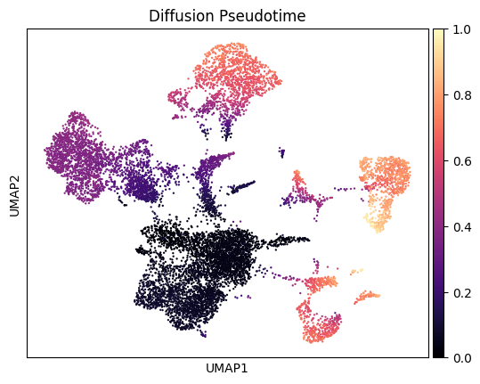

# Single-cell-RNA-seq-Analysis

# Overview
This repository presents a robust, end-to-end single-cell RNA-sequencing (scRNA-seq) analysis pipeline built in Python using **Scanpy**. It provides:

- Automated data fetch and merge from GEO (10x-like format).
- Quality control (QC) filtering and visualization.
- Dimensionality reduction (PCA, UMAP).
- Clustering (Leiden) and marker identification.
- Classifying clusters with a custom marker dictionary.
- Differential expression analysis (intra-cluster condition comparisons).
- Pseudo-bulk creation and visualization.
- Pseudotime (diffusion-based) analysis.

Single-cell RNA-seq offers a powerful advantage over bulk transcriptomics by allowing you to dissect transcriptomic heterogeneity within individual cells from complex tissues or conditions. This pipeline equips you with reproducible steps to handle various aspects of single-cell data—from data ingestion and QC to clustering, cell-type annotation, pseudo-bulk comparisons, and trajectory inference.

---

## Why Single-Cell RNA-Seq Over Bulk?

### Cellular Heterogeneity

Bulk RNA-seq provides an averaged expression profile across all cells. If your tissue or sample is composed of multiple cell types, rare subpopulations can be drowned out by abundant cell types. In contrast, single-cell RNA-seq captures the transcriptomes of individual cells, revealing subtle differences among subpopulations and enabling you to discover new cell types and states.

### Trajectory and Developmental Insights

Single-cell data is particularly advantageous for tracing lineages and inferring pseudotime trajectories. This is nearly impossible with bulk profiles, which lack the resolution to distinguish intermediate cellular states and transitions.

### Identifying Rare Populations

Rare cell types—even at 1% or lower frequency—can be discovered in single-cell data without being overshadowed by the more abundant ones. Bulk sequencing might miss these populations entirely.

### Intra-Cluster and Inter-Condition Analysis

For certain experimental designs (e.g., disease vs. control), you can compare conditions at the cell-type or cluster level, revealing cell-type–specific transcriptional changes. Bulk data cannot distinguish which cell type is driving a differential expression signal without additional methods like flow-sorting.

---

## Quick Highlights of This Pipeline

### Automated Download/Decompression

The scripts automate pulling data from GEO (10x-like files: matrix, barcodes, features), decompressing them, and merging into a single AnnData object—saving time and avoiding manual steps.

### Comprehensive QC

Our pipeline demonstrates how to calculate and visualize QC metrics (e.g., total UMIs, number of genes per cell, mitochondrial content), then filter out low-quality cells or genes.

### Clustering and Visualization

We show how to cluster cells (Leiden), reduce dimensions (PCA and UMAP), and visually inspect clusters and their key markers.

### Marker-Based Cell-Type Annotation

By providing a custom dictionary of gene markers, you can get an initial guess on cell-type identities. This dictionary is easily extensible with domain knowledge or additional references.

### Pseudo-Bulk Analysis

Sometimes you want to treat each single-cell cluster (or condition+cluster group) as a “bulk sample.” The script includes a function to sum counts within those groups and generate advanced visualizations—bar plots, correlation heatmaps, and PCA—mimicking standard bulk RNA-seq workflows.

### Pseudotime Analysis

The pipeline includes a diffusion pseudotime step so that you can order cells along putative differentiation or developmental trajectories. Alternative methods (like scVelo or PAGA) can also be integrated.

### Differential Expression

We demonstrate both cell-level (via `rank_genes_groups`) and condition-level comparisons, providing insight into how gene expression changes within a cluster between two experimental states.

---

## Key Take-Home Messages

### Resolution Matters

Single-cell data gives you the power to investigate heterogeneity and discover rare or unexpected cell states that are invisible in bulk RNA-seq. Our pipeline ensures you maintain fine-grained control from QC to downstream analyses.

### End-to-End Reproducibility

From data fetching to annotation, everything is laid out in Python code. By running this pipeline, you ensure consistent, reproducible results—vital for collaborative projects or publication.

### Modular and Extensible

Each function is designed to be reused and adapted. Want to add more complex marker dictionaries? Or filter differently, or adopt scVelo for velocity-based pseudotime? Simply integrate new modules without rebuilding your pipeline from scratch.

### Bridging Single-Cell and Bulk

Pseudo-bulk analysis brings a familiar bulk-based approach to single-cell data, helping cross-validate single-cell findings with established bulk RNA-seq workflows and facilitating easy integration into legacy pipelines.

### Trajectory Insights

The included pseudotime method is just one entry point. With the data easily accessible in AnnData, you can apply advanced trajectory tools (Scanpy’s PAGA, scVelo, Monocle3, etc.) to deeply explore lineage relationships.

---

## Recommendations for Users

### Clone or Download 
   Get the entire script and supporting files in one place. Make sure you have installed the required packages.

### Modify Thresholds
   The default parameters for filtering (e.g., mitochondrial % cutoffs, minimum gene count per cell) are starting points. Adjust them based on your tissue, capture protocol, or known biology.

### Extend the Marker Dictionary  
   Add cell-type markers specific to your organism or tissue of interest. This dictionary-based approach helps jump-start annotation but can also be refined with additional domain knowledge.

### Explore Pseudo-Bulk
   Try grouping by cluster alone or cluster+condition. These pseudo-bulk aggregates can be used in standard bulk RNA-seq DE pipelines (e.g., DESeq2 or edgeR), bridging single-cell and bulk analysis frameworks.

### Try Different Trajectory Methods
   Diffusion pseudotime is just one approach. If you have spliced/unspliced data, check out [scVelo](https://scvelo.readthedocs.io/) for RNA velocity-based pseudotime. Experiment with PAGA or [Monocle](http://cole-trapnell-lab.github.io/monocle-release/) for alternative trajectory inference.

---

## How This Code Benefits Your Research

### Time Savings

A single script automates numerous steps that otherwise can be error-prone if done manually. Fewer manual steps means fewer mistakes and more time for biology interpretation.

### Greater Confidence

By thoroughly visualizing QC metrics and systematically filtering cells, you reduce noise and gain confidence in your downstream clustering and differential expression results.

### Deeper Insights

The ability to identify cell types (or at least get strong “hints” through known markers) helps you contextualize your findings—whether you’re pinpointing new subtypes of immune cells or distinguishing subtle transitions in a developing tissue.

### Adaptable

Because everything is built around the widely used **Scanpy + AnnData** framework, you can easily incorporate new steps or switch to advanced algorithmic modules. The pipeline is flexible enough to handle different species, tissues, or additional metadata.

---

## Getting Started

### Install Python packages 
   Make sure you’ve installed the core dependencies (e.g., scanpy, anndata, seaborn, scikit-learn).

### Update the “sample_data” array  
   Provide your own GEO accession IDs/file prefixes (or skip downloading if you already have local 10x files).

### Run the script in a Jupyter notebook or command line. You will see:  
   - QC plots to help you confirm or adjust thresholds.
   - UMAP/Leiden clustering and cluster annotation.
   - Differential expression summary files.
   - Pseudo-bulk DataFrames and PCA plots.
   - Pseudotime visualizations on your UMAP.

### Explore results 
   Tweak thresholds or expand the marker dictionary. Keep iterating until you are satisfied with the cluster definitions, annotations, and gene signatures.

---

## Contributing and Future Extensions

Feel free to contribute additional functionality (e.g., advanced trajectory methods, scVelo integration, advanced batch correction, etc.). Explore specialized downstream analyses such as ligand-receptor interaction ([CellPhoneDB](https://www.cellphonedb.org/) / [NicheNet](https://github.com/saeyslab/nichenetr)), velocity, or multi-omics expansions (CITE-seq, scATAC-seq integration).

---

## License and Citation

This pipeline is inspired from evanpeikon's take on scRNA-seq analysis and provided as-is. You’re free to reuse and modify. If you find it helpful in academic research, please cite relevant Scanpy references and mention this code repository.

### Happy single-cell analyzing!
